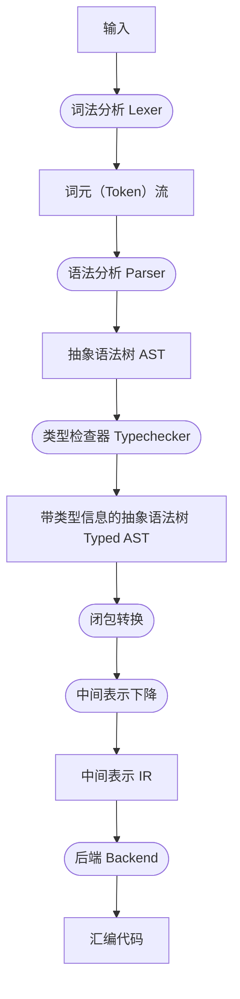
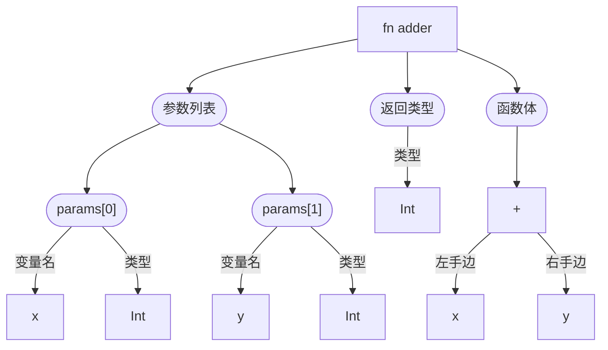

# 编译器结构总览与语言简介

## 编译器的结构

对很多人来说，编译器是一个吃进去代码、吐出来机器码的神秘机器。

老实说，确实。但是这并不意味着这个机器是什么难以理解的高阶计算机魔法。
事实上，对于很多编译器而言，其内部结构就是一个流水线。
这个流水线的每一步的内部结构可能没有那么简单，
但是整体上来讲，就是就是每一个步骤吃进去一些东西，吐出来一些东西，
如此一步步转换下来就变成机器码了。

就用我们这个教程中介绍的（以及比赛中用到的）MiniMoonBit 举例，
我们给出的编译器框架的内部结构大概是这样的：



看起来很长，而且充斥着看不懂的名词？

没事。在后面的章节，我们会一一对引入的这些名字进行解释。
这些中间步骤的输出都是有很多现实意义的东西，
在调试的过程中，我们也可能会经常需要查看这些中间结果。

## 我们要编译的编程语言

作为 MiniMoonBit 的教程，我们当然要在这里介绍 MiniMoonBit 编程语言。
毕竟计算机科学（至少相比于它的应用场景来说）是一门严谨的学问，
我们自然也要用一些严谨的方式定义编程语言本身。

### 抽象语法树

我们举一个你可能会在 MiniMoonBit 里面遇到的例子：

```
fn adder(x: Int, y: Int) -> Int {
    x + y
}

fn main {
    print_int(adder(1, 2))
}
```

看到这个程序，你大概会自然而然地如此理解它的含义：

- 这里有两个函数，分别是 `adder` 和 `main`
- 在 `adder` 中：
  - 函数有两个参数，分别是 `x` 和 `y`，类型都是 `Int`
  - 函数的返回值是 `Int`
  - 函数体是一个表达式 `x + y`
    - 这个表达式是一个加法表达式，参数是变量 `x` 和 `y`
- 在 `main` 中：
  - 函数没有参数
  - 函数体是一个表达式 `print_int(adder(1, 2))`
    - 这个表达式是一个函数调用，调用的函数是 `print_int`
    - `print_int` 的参数是另一个函数调用 `adder(1, 2)`
      - 这个函数调用的函数是 `adder`
      - 参数是两个整数常量 `1` 和 `2`

你可能发现这个理解程序结构的方式有点像是一颗树。
那么，就让我们真的把它写成一颗树：

```
function:
    name: "adder"
    params:
        - name: "x"
          type: Int
        - name: "y"
          type: Int
    return_type: Int
    body:
        add:
            left: x
            right: y
```

或者，如果你更喜欢直观的图：



这样的树形结构完整体现了原本用文本写成的程序的内部结构，
我们管它叫做 [**抽象语法树**][ast] (Abstract syntax tree, AST)。

注意到它的名字里有 “抽象” 这两个字了吗？
这里，“抽象” 的意思是这个语法树并不会忠实地表达原本的程序中的所有内容。
例如，用于声明函数的 `fn` 、参数列表的括号、程序里的空格等部分都没有体现在这棵树上；
相反，这棵树只关心那些真的对理解程序的含义有帮助的部分，比如变量名、类型和表达式的结构等。

我知道你很好奇——所谓的 “[具象语法树][cst]” (Concrete syntax tree, CST) 也是存在的。
它还有一个名字，叫做 “解析树” (Parse tree)，指的是从语法分析器（Parser）中直接得到的语法结构。
我们不会在这个教程中详细讲解它，但是它在代码格式化器和错误处理中也有一定的用武之地。

[ast]: https://en.wikipedia.org/wiki/Abstract_syntax_tree
[cst]: https://en.wikipedia.org/wiki/Parse_tree

回到抽象语法树上。
我们刚刚用作例子的东西很明显不是你真正写到程序里面的数据结构定义，
不过根据我们看到的这些结构，你应该也可以很容易地写出它的实际定义：

```mbt
/// 代表整个程序
struct Program {
    top_levels: Array[TopLevel]
}

/// 顶层结构（函数和变量声明等等）
enum TopLevel {
    Function(func~: Function)
}

/// 代表一个函数
struct Function {
    name: String
    params: Array[Param]
    return_type: Type
    body: Expression
}

/// 代表一个参数
struct Param {
    name: String
    ty: Type
}

/// 类型定义，为了简单我们就先用字符串代替吧
struct Type {
    name: String
}

/// 表达式定义，可能有很多种，所以我们用一个 enum 表示
enum Expression {
    /// 变量
    Variable(name~: String)
    /// 整数常量
    IntLiteral(value~: Int)
    /// 加法表达式
    Add(left~: Expression, right~: Expression)
    /// 函数调用
    Call(func~: Expression, args~: Array[Expression])
}
```

这样我们就得到了 MiniMoonBit 抽象语法树的一个简化版本。
实际的抽象语法树定义可以在模板仓库里面找到，但是思路是相似的。

### 定义程序语言的语法

我们刚刚讲了如何在内存中表示一段程序的结构，
但是在程序文本和抽象语法树之间显然还隔着一层定义——程序语言的语法。
在编程语言中，我们一般会用一种叫做 [**巴科斯-努尔范式**][bnf] (Backus-Naur Form, BNF) 的方式，
以及它的扩展版本——[扩展巴科斯-努尔范式][ebnf] (Extended Backus-Naur Form, EBNF)
等方式来定义一个程序语言的语法。

不严谨地说，BNF 把每个语法结构看作一个 “符号”。
BNF 本身则是一系列规则，每一条规则表示一个符号可以被转换成什么样的符号序列。

要想写出 BNF，我们需要做一点符号上的约定：

- 一个（编程语言意义上的）标识符表示一个上述的 “符号”（称为非终结符），
  这个符号必须被扩写成实际的字符串；
- 一个引号括起来的字符串表示一个实际出现的字符串（称为终结符）；
- 冒号 `:` 前面是最终产生的符号，后面是它可以被转换成的符号串，用空格连接；
- 每一条规则由分号结尾。

举一个简单的例子，下面的语法定义了一个简单的类型标注：

```antlr
ty: "Int";
ty: "Array" "[" ty "]";
```

他表示的意思是：

- `ty` 符号可以被扩写成 `Int` 这个字符串；
- `ty` 符号也可以被扩写成 `Array`，接着一个左方括号，接着一个 `ty` 符号，最后是一个右方括号。
  其中的 `ty` 符号可以继续被扩写成 `Int` 或者其他东西。

通过重复执行这个扩写过程，我们可以找到一些符合这个语法中 `ty` 符号的字符串，比如：
`Int`, `Array[Int]`, `Array[Array[Int]]` 等等。

我们也可以试着写出一些其他语法结构的定义，比如标识符：

```antlr
// 数字
number: "0"; number: "1"; ...; number: "9";
// 字母
letter: "A"; ...; letter: "z";
// 标识符要以字母开始，然后后面接着零或多个数字或者字母
ident: letter ident_rest;
// 标识符第一个字母之后的部分
ident_rest: letter ident_rest;
ident_rest: number ident_rest;
ident_rest: ""; // 这里 "" 代表一个空的字符串
```

试着理解一下，比如标识符 `m1n1` 可以这么产生：

```
   ident
-> letter ident_rest
-> "m" ident_rest
-> "m" letter ident_rest
-> "m" "1" ident_rest
-> "m" "1" letter ident_rest
-> "m" "1" "n" ident_rest
-> "m" "1" "n" number ident_rest
-> "m" "1" "n" "1" ident_rest
-> "m" "1" "n" "1" ""
-> "m1n1"
```

当然，上面这种写法太啰嗦了，所以计算机科学家们引入了 EBNF，通过增加几种惯用的符号来简化语法定义的写法：

- 竖线 `|` 表示 “或者”，表示既可以选择扩写成左边的部分，也可以选择扩写成右边的部分；
- 星形 `*` ([Kleene star][]) 表示 “零个或多个”，表示它前面的符号可以重复出现零次、一次、两次，等等；
- 加号 `+` 表示 “一个或多个”，表示它前面的符号至少要出现一次，之后可以重复出现零次、一次、两次，等等；
- 问号 `?` 表示 “零次或一次”，表示它前面的符号可以出现一次，也可以不出现。
- 括号 `(...)` 表示把括号里面的内容作为一个整体来看待。

使用 EBNF，我们可以把上面的标识符定义简化成：

```antlr
number: "0" | ... | "9";
letter: "A" | ... | "z";
ident: letter (letter | number)*;
```

这就好看多了。

我们可以尝试使用 EBNF 写出我们的示例程序的语法定义（为了简单，忽略了所有空白字符）。
你可以试着从 `program` 开始，尝试构造几个符合这个语法的程序：

```antlr
program: top_level*;
top_level: function;

// 函数
function: "fn" function_name function_body;
function_name: "main" | ident "(" param_list? ")" return_type?;
function_body: "{" expression "}";
param_list: param ("," param)*;
param: ident ":" ty;
return_type: "->" ty;

// 表达式
expression: addition | function_call | variable | int_literal;
addition: expression "+" expression;
function_call: ident "(" arg_list? ")";
arg_list: expression ("," expression)*;
variable: ident;
int_literal: number+;

ty: "Int";
ident: ...; // 同上
number: ...; // 同上
```

通过 BNF/EBNF，我们就可以严谨地定义一门编程语言的语法了。
我们将在下一章中介绍如何把文本格式的程序逐步转换到抽象语法树。

> _等等，你是不是跳过了些什么？_
>
> 是的，我们这里讨论的全部都是 [上下文无关文法][cfg]。
> 编程语言的解析是一个很复杂（但是在一定程度上，对常见实现不怎么重要）的话题，所以这里跳过了很多东西。
> 如果你感兴趣的话，可以查看 [形式语言][formal-langs] 的相关知识，
> 或者在你的大学中选修 “形式语言与自动机” 之类的课程。
>
> 我们采用的符号约定更类似 [ANTLR][] 的语法定义方式，而不是学术上 BNF/EBNF 的标准写法。
> 这是因为我们的示例文法和材料都使用了 ANTLR 的语法规则。
> ANTLR 使用的符号和学术上的写法基本上是一一对应的，只是使用的具体符号不同而已。

[bnf]: https://en.wikipedia.org/wiki/Backus%E2%80%93Naur_form
[ebnf]: https://en.wikipedia.org/wiki/Extended_Backus%E2%80%93Naur_form
[abnf]: https://en.wikipedia.org/wiki/Augmented_Backus%E2%80%93Naur_form
[cfg]: https://en.wikipedia.org/wiki/Context-free_grammar
[formal-langs]: https://en.wikipedia.org/wiki/Formal_language
[antlr]: https://www.antlr.org/
[Kleene star]: https://en.wikipedia.org/wiki/Kleene_star
